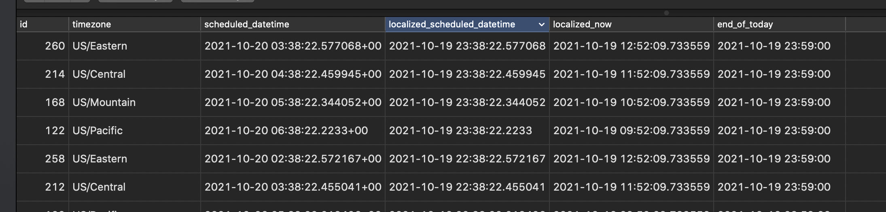

# timezone_lookup_example

```shell
docker compose build
docker compose up
poetry run python manage.py create_cross_timezone_data
```

PSQL query to return all TODOs after their scheduled time but still today in the user's timezone
```postgresql
select 
	t.id,
	u.timezone,
	t.scheduled_datetime,
	t.scheduled_datetime at time zone u.timezone as localized_scheduled_datetime,
	now() at time zone u.timezone as localized_now,
	date_trunc('day', now() at time zone u.timezone) + interval '23 hours 59 minutes' as end_of_today
from app_todo as t
join app_user as u on t.user_id = u.id
where 
	-- todo scheduled datetime is before the end of the user's today
	t.scheduled_datetime at time zone u.timezone < date_trunc('day', now() at time zone u.timezone) + interval '23 hours 59 minutes'
	and 
	-- todo utc scheduled datetime is after utc now
	t.scheduled_datetime > now()::timestamp
;
```

Example of query output

